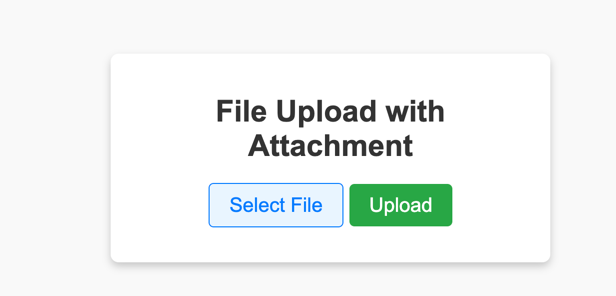

# fileUpload
you can manage you own file by website.



## upload
http://localhost:3000/upload.html

## download
http://localhost:3000


you can download these files by nginx.

```nginx.conf
    location / {
        autoindex on;
        root   /usr/share/nginx/html;
        index  index.html index.htm;
    }

    location /upload.html {
        index  index.html index.htm;
        proxy_pass http://localhost:3000/upload.html;
    }

    location /upload {
        index  index.html index.htm;
        proxy_pass http://localhost:3000;
    }

    location /move-file {
        index  index.html index.htm;
        proxy_pass http://localhost:3000;
    }
```